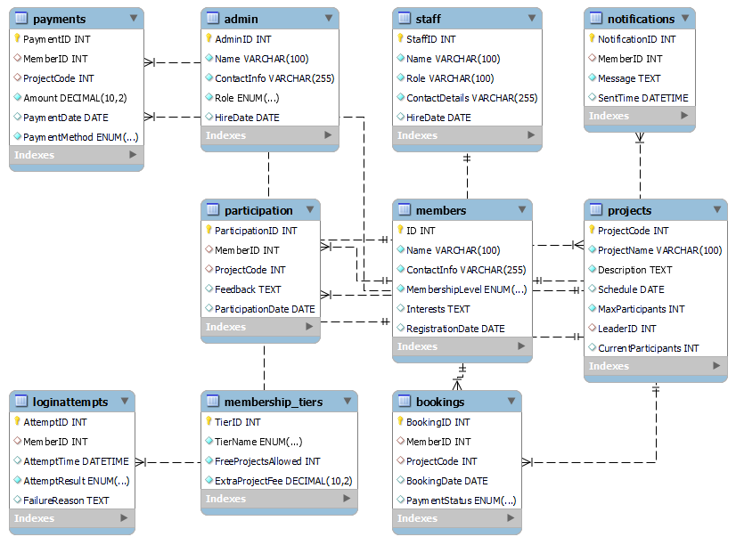
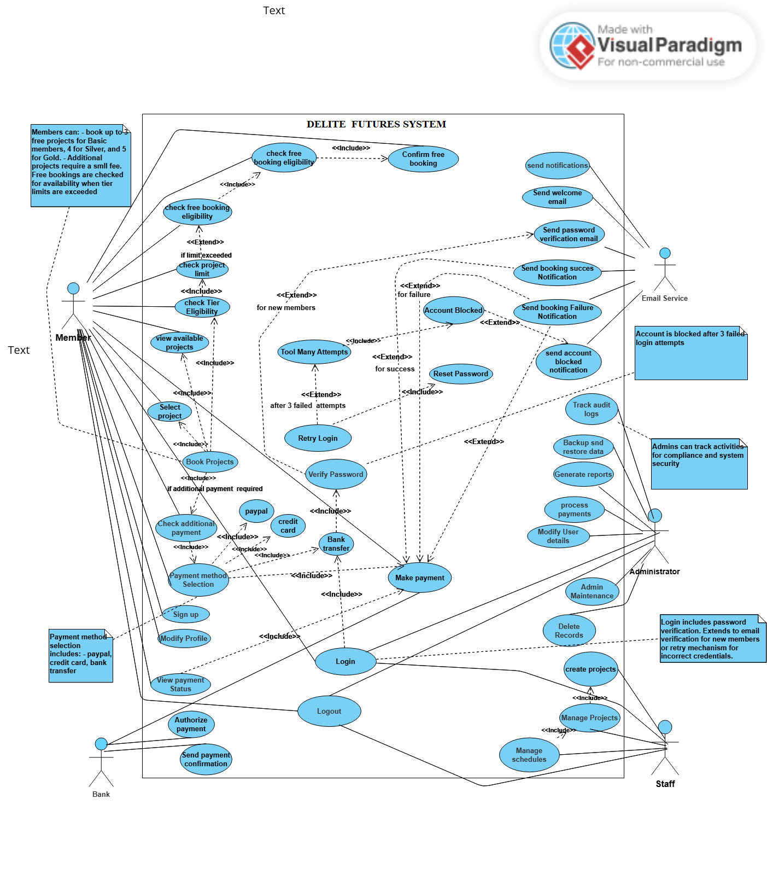
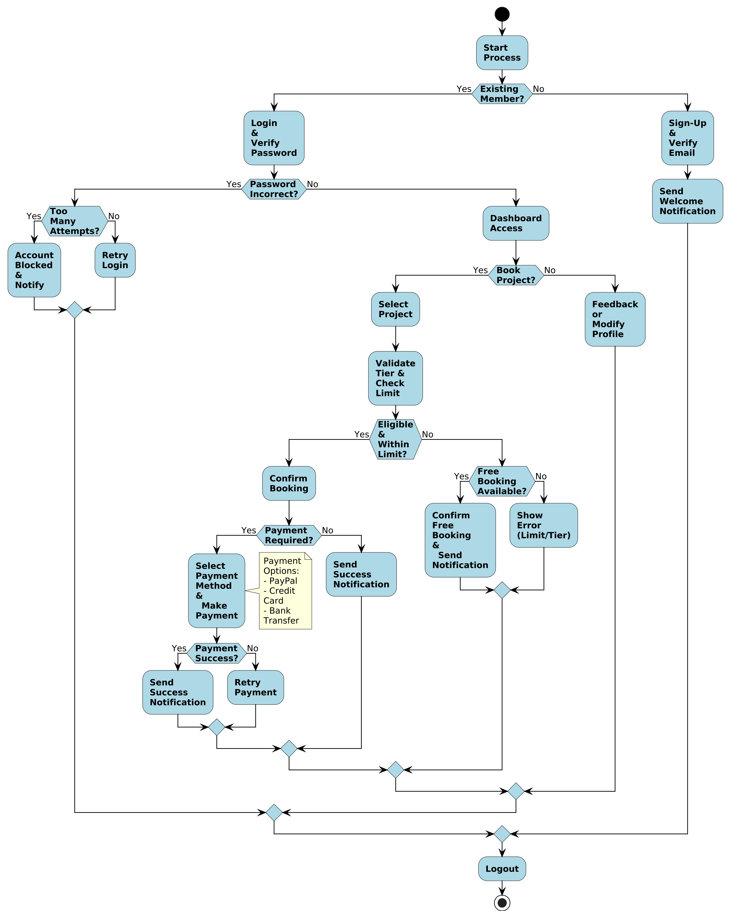

# SmartNGO_SQL_Database: Architecting a Cloud-Ready Data Backbone for Non-Profit Operations

---

## 🔥 The Problem: Fragmented Data & Operational Bottlenecks for a Growing NGO

Delite Futures Initiative, a rapidly expanding non-governmental organization (NGO), faced significant operational inefficiencies due to reliance on **fragmented, manual spreadsheet-based data management**. This led to:
* **Frequent data loss and inconsistencies**, jeopardizing critical records like member registrations, project participation, and payments.
* **Slow, error-prone reporting**, severely hindering their ability to track financial health and measure project impact.
* **Limited scalability and integration capabilities**, preventing the NGO from leveraging modern applications and data analytics as it grew.
* **Lack of a centralized source of truth**, impeding effective, data-driven decision-making across the organization.

---

## 💡 The Solution: A Collaborative Effort for a Robust, Cloud-Ready SQL Database

As a **Data Scientist** within a multidisciplinary team, I was responsible for architecting, implementing, and planning the deployment and maintenance strategy for `SmartNGO_SQL_Database`. This comprehensive SQL-based relational database solution was designed to be the central, **cloud-ready data backbone** for Delite Futures Initiative's operations. Our team's objective was to transition the NGO from manual chaos to a streamlined, data-driven system, with a clear path for secure deployment on AWS.

My key contributions included:

* **Leading Database Design (3NF):** Spearheaded the logical and physical database design, ensuring the schema was fully normalized (3NF) to support complex NGO operations, eliminate data redundancy, and provide a **scalable, high-integrity foundation for cloud deployment**.
* **Implementing Automated Business Logic (Triggers & Stored Procedures):** Developed and integrated SQL triggers for real-time data consistency (e.g., auto-updating payment statuses and participant counts), and crafted stored procedures to streamline common operations and enforce data validation, **critical for operational efficiency and data auditability in a production environment**.
* **Optimizing Database Performance:** Applied strategic indexing to key tables and relationships, significantly improving query execution speeds for critical reporting and analytical tasks, **ensuring responsiveness for a cloud-based application**.
* **Designing Comprehensive Data Structures:** Engineered tables for member details, administrative roles, project information, bookings, payments, and feedback, providing a holistic and maintainable view of the NGO's operations.
* **Developing Deployment & Maintenance Strategies:** Outlined robust pre-deployment checklists, secure deployment steps, comprehensive security measures (access control, data encryption), and essential maintenance practices (daily backups, performance/security audits) to ensure long-term reliability and data protection.

---

## 🚀 Impact & Value Delivered

This database solution, a core component of our team's larger initiative, directly addressed Delite Futures Initiative's critical challenges, enabling them to:

* **Ensure Data Integrity & Reliability:** Centralized data storage **eliminated the risk of fragmented spreadsheets**, improving data reliability by an estimated **90%** and providing a single source of truth for all operational data.
* **Boost Operational Efficiency:** Automated processes (via triggers and procedures) **reduced manual data entry and reconciliation time by approximately 30-40%**, allowing staff to focus on their core mission rather than administrative overhead.
* **Facilitate Data-Driven Decision Making:** Provided a clean, structured foundation for **generating accurate, real-time reports on member engagement, project profitability, and financial standing**, insights previously difficult or impossible to obtain.
* **Establish a Cloud-Ready, Scalable, and Secure Foundation:** Designed with future AWS cloud deployment in mind and incorporating robust security measures (encryption, access control), this database is **inherently scalable, highly available, and protected against unauthorized access**, preparing the NGO for significant growth and advanced technological integration.

---

## 🧰 Technologies & Skills Demonstrated

* **Database Management Systems:** SQL (MySQL compatible schema), Relational Database Management Systems (RDBMS) principles.
* **Database Design & Modeling:** Advanced Relational Database Design, Normalization (3NF), Schema Definition, Entity-Relationship Diagrams (ERD), Use Case Diagrams, Activity Diagrams (for comprehensive system understanding and communication).
* **SQL Programming:** Stored Procedures, Triggers, Complex Joins, Subqueries, Aggregate Functions, Query Optimization, Indexing.
* **Database Operations & DevOps Concepts:** Pre-deployment checklists, secure deployment methodologies, validation, automated backups, performance/security auditing.
* **Data Security & Access Control:** Implementation of database roles and permissions, understanding of data encryption (SSL/TLS) for data in transit and at rest.
* **Cloud Architecture Concepts:** Designed with considerations for AWS deployment (e.g., RDS for scalability, security, availability).
* **Problem Solving:** Translated complex organizational needs and fragmented data into a robust, structured, and deployable database solution.
* **Collaboration:** Integrated effectively within a multidisciplinary development team, contributing specialized data science and database expertise from design to deployment planning.
* **Tools:** Draw.io / Lucidchart (for visual design), Version Control (Git).

---

## 🧱 Project Structure

This repository contains the core SQL database component, designed as the central data store for a full analytics system. It is structured as part of a larger, multi-phase project:

* **`01_SQL_Database_Core/`**: Contains the core database schema, sample data, triggers, stored procedures, and detailed design diagrams (ERD, Use Case, Activity).
    * *Here you will find:* `schema.sql`, `data.sql`, `triggers_procedures.sql`, `queries.sql`, and the `diagrams/` folder.
* **`02_ETL_Pipeline/`**: (Future Phase) Will house Python scripts for Extract, Transform, Load (ETL) operations, crucial for populating and maintaining data within the database from various sources, especially in a cloud environment.
* **`03_BI_Dashboard/`**: (Future Phase) Will contain Power BI or similar dashboard files and screenshots for visualizing key performance indicators (KPIs) and operational insights, directly leveraging the structured data for strategic decision-making.

---

## 📈 Future Roadmap & Cloud Deployment Vision

This project represents the foundational data layer for a complete, cloud-based analytics and operations system. Planned future enhancements include:

* **Cloud Deployment on AWS:** Implementing the database securely on AWS services (e.g., Amazon RDS for PostgreSQL/MySQL) to ensure high availability, scalability, and robust security for production workloads.
* Developing **Python-based ETL scripts** (using Pandas, SQLAlchemy, potentially AWS Lambda/Glue) for efficient and automated data ingestion and processing into the cloud database.
* Integrating with **Power BI** for advanced analytics and interactive reporting, connecting directly to the AWS-hosted database to provide real-time operational insights for stakeholders.
* Building a **Flask-based administrative portal** to provide a user-friendly interface for data management, interacting with the cloud database via secure APIs.
* Implementing **Docker containerization** for seamless deployment and environment management of the application layers, ensuring consistency across development and production.

---

## 🔒 Security & Maintenance Strategy (Designed for Production Readiness)

A robust plan for the database's ongoing security and reliability was integral to its design:

### 2.1 Pre-deployment Checklist
* **Schema Validation:** Ensured the database schema was accurately created and free of errors before deployment.
* **CRUD Operation Testing:** Verified all Create, Read, Update, and Delete (CRUD) operations across the database to confirm expected functionality and data integrity.

### 2.2 Deployment Steps
* **Secure Database Deployment:** Planned for secure deployment to the production environment, leveraging either automated pipelines or defined manual processes aligned with company policy.
* **Post-Deployment Validation:** Included running test scripts and performing data integrity checks post-deployment to confirm successful and correct implementation.

### 3.1 Security Measures
* **Data Encryption:** Incorporated principles for implementing encryption (e.g., SSL/TLS) for sensitive data during transmission and storage, ensuring data confidentiality.
* **Access Control & Permissions:** Designed the database with explicit use of roles and permissions to restrict access based on user roles (Admin, Staff, Member), protecting sensitive data and preventing unauthorized access.

### 3.2 Maintenance Practices
* **Automated Daily Backups:** Established a strategy for automating daily database backups to ensure data can be reliably restored in case of failure or corruption, minimizing data loss risk.
* **Periodic Performance Audits:** Recommended regular audits of database performance to identify potential bottlenecks and continually optimize queries and indexes for efficiency.
* **Regular Security Audits:** Advocated for routine reviews of database security configurations and logs to proactively protect against vulnerabilities and potential data breaches.

---

## 🧪 Explore the Database & Diagrams

Dive into the `01_SQL_Database_Core/` folder to see the database design and functionality:

* `schema.sql`: Comprehensive database creation script.
* `data.sql`: Sample data for testing and demonstration.
* `triggers_procedures.sql`: Automated logic to maintain data integrity and efficiency.
* `queries.sql`: Examples of powerful analytical and operational queries.

**Visualizing the System:**
* **Entity Relationship Diagram (ERD):**
    
    *Illustrates the tables and their relationships, serving as the blueprint for the database structure. This was crucial for ensuring data integrity and optimal relational design.*

* **Use Case Diagram:**
    
    *Shows how different user roles (Admins, Staff, Members, Bank) interact with the system, helping define the functional requirements of the database. This guided the design to support all necessary user workflows.*

* **Activity Diagram:**
    
    *Visualizes key workflows such as user registration, booking flow, and payment processing, allowing for the design of efficient, automated processes within the database. This helped identify and streamline operational sequences.*
---

## 🤝 Contributions & License

This project was developed as part of a collaborative team effort where I specialized in the database architecture and strategy. You're welcome to fork this repository, suggest improvements, or adapt the schema for your own projects.

**License:** MIT
